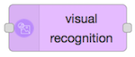
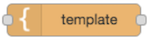
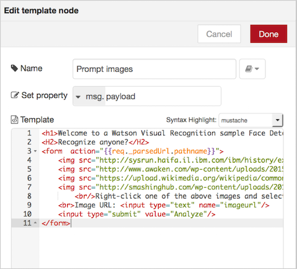
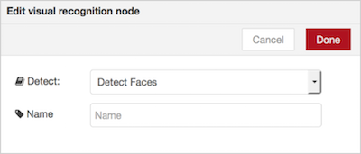

# Watson Visual Recognition APIを使った画像認識アプリの作成

## 概要
IBM Watsonのサービスの一つであるVisual Recognition APIを呼びだす簡単なサンプルです。
Node-REDを使って簡単に呼び出しているのが特徴です。IBM Bluemixを使えば簡単に、迅速にアプリケーションを作ることが可能です。

## ノード解説 - visual recognition node
IBMがBluemixは様々なコグニティブAPIを提供しています。その中でも画像認識サービスである、Visual Recognition  は画像解析から年齢や人物判定まで行う機能を持ったサービスです。IBM Watsonのカテゴリに入っているので確認してみてください。

## 全体フロー概要
画像のURL（例："http://xxxxx.jpg" ）をVisual Recognition のAPIにかけると画像解析を行い、顔認識の結果を返してくれるサンプルアプリです。

***
## 1. BluemixでNode-REDサービスを設定する
[Bluemix Hands-On #1](https://github.com/kifumi/visualrecognition_nodered/blob/master/20161210_1.pdf "Bluemix Hands-On #1")の資料を参照してください。

## 2. Visual Recognition APIを追加する
Node-REDのノードに画像認識のための Visual Recognition があるのですが、このままでは使えません。 このNode-REDのアプリケーションにVisual Recognition APIを追加してあげる必要があります。
Bluemixのメニュー画面左上の「IBM Bluemix」をクリックし、「すべてのアプリ」一覧のなかから、1.で作ったNode-REDのアプリケーションをクリックしてください。 
 
左側の「接続」をクリックし、右側の「新規に接続」のアイコンをクリックします。
 
左側の「Watson」をクリックし、「Visual Recognition」を選択します。
 
「作成」をクリックします。
 
「アプリケーションの再ステージ」のポップアップ画面が現れるので「再ステージ」をクリックします。
再ステージングし正常に再起動すればOKです！

## 3. Node-REDでプログラミング
「アプリの表示」をクリックし、「Go to your Node-RED flow editor」をクリックして、Node-REDがを起動します。

Node-REDエディターが立ち上がったら、上側右寄りの「＋」をクリックして、新しいフロー画面「Flow 2」を立ち上げます。

## 3-1. HTTP Input node
Visual Recognition API は REST の GET メソッドでアクセスして画像を解析します。
左側のパレットの Input カテゴリ内の http のノード をドラッグ&ドロップし、キャンバス内に配置します。 
プロパティー内のURL欄にアクセスポイントを記載します。ここでは/callwatson にしておきます。Name の欄はノードの名前をわかりやすいようにしておくために記述しておきます。任意ですが、ここでは HTTP Input にしておきます。

## 3-2. switch node
画像のURLをチェックするノードを準備します。 
左側のリソースパレットの function カテゴリ内のswitch ノードをフローエディタ中央のキャンバスにドラッグ&ドロップします。
プロパティー内の左下にある「+add」をクリックして、分岐ロジックを2つ用意します。Propertyは、右図の通りに imagurl属性に含まれるペイロードのnullチェックを行います。nullであれば、"1"にそれ以外であれば"2"に値が渡されます。

## 3-3. template node (初期画面)
画面のHTMLを表示したり、Inputとなる画像を送信するためのメニューを提供するためにHTMLを記述します。 
templateノードをフローエディタ中央のキャンバスにドラッグ&ドロップします。
プロパティを以下のように記述します。

    <h1>Welcome to a Watson Visual Recognition sample Face Detection app</h1>
    <H2>Recognize anyone?</H2>
    <form  action="{{req._parsedUrl.pathname}}">
     
      
       
         
     Right-click one of the above images and select Copy image location and paste the URL in the box below. Do an image search for faces, try multiple faces. After you click on an image, to the right it usually says "View image" click that to get the URL. 
     Image URL: <input type="text" name="imageurl"/>   
    <input type="submit" value="Analyze"/>
    </form>
  
  

## 3-4. change node
入力画面から画像URLを抽出するchangeノードを定義します。
左側のリソースパレットの function カテゴリ内のchangeノードをフロー・エディタ中央のキャンバスにドラッグ&ドロップします。 
ここからpayload属性をimageurl属性に変換します。以下の通りにプロパティを設定します。 

## 3-5. Image Analysis
画像解析のための visual recognitionノードを定義します。
左側のリソースパレットの IBM_Watson カテゴリ内の visual recognitionノードをフロー・エディタ中央のキャンバスにドラッグ&ドロップします。 
プロパティーでは顔認識を行うため、以下の通りにDetectをDetect Facesに設定します。

## 3-6. template node (結果)
WatsonのImage Analysisから返ってきた結果を表示させるためのHTMLを記載します。
temlplateノードをフローエディタ中央のキャンバスにドラッグ&ドロップします。
プロパティを以下のように記述します。

        <h1>Visual Recognition v3 Image Analysis</h1>    
        
Analyzed image: {{result.images.0.resolved_url}} 
    
        {{^result}}        
        
No Face detected
    
        {{/result}}    
        
Images Processed: {{result.images_processed}}
    
        <table border='1'>        
        <thead><tr><th>Age Range</th><th>Confidence</th><th>Gender</th><th>Confidence</th><th>Name</th></tr></thead>        
        {{#result.images.0.faces}}<tr>            
        <td><b>{{age.min}} - {{age.max}}</b></td><td><i>{{age.score}}</i></td>            <td>{{gender.gender}}</td>
        <td>{{gender.score}}</td>            <td>{{identity.name}} ({{identity.score}})</td>       
        </tr>{{/result.images.0.faces}}    
        </table>    
        <form  action="{{req._parsedUrl.pathname}}">        
         <input type="submit" value="Try again or go back to the home page"/>    
        </form>

## 3-7. フローをつなげる
最後に http responseノードをフローエディタ中央のキャンバスにドラッグ&ドロップします。
出来上がった各ノードをつなげて、右上のDeployをクリックすれば完成です!エラーが出ていないことを確認してください。 

## 4. 動作確認
ブラウザのURL欄に http://xxxx.mybluemix.net/callwatson をインプットして呼び出してみましょう。 
Image URLの入力欄にWatsonに読ませたい画像URLを入れてみてください。
